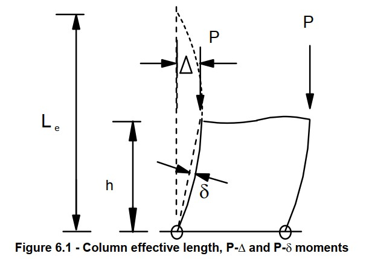

# 6 DESIGN METHODS AND ANALYSIS
设计和分析方法

## 6.1 METHOD OF ANALYSIS
分析方法

Second-order effects should be included in an analysis unless they can be proven to be insignificant. The P-Δ and the P-δ effects should be considered either in the analysis or in the design stage depending upon analysis method used.

应考虑结构二阶效应，除非可以证明它们是无关紧要的。根据所采用的分析方法，在分析或设计阶段应考虑P-Δ和P-δ效应。

The internal forces and moments acting on a structure may be calculated by one of the following analysis methods:
作用在结构上的内力和弯矩可通过下列分析方法之一计算：

(1) Simple design, lateral forces taken by linked rigid structure and beams are assumed simply supported on columns (see clause 6.5);
(1) 简单的设计，连接刚性结构和梁承受的侧向力假定为简支在柱上（见第6.5条）；

(2) First-order linear elastic analysis, using the original and undeformed geometry of the structure (see clause 6.6);
(2) 一阶线性弹性分析，使用结构的原始和未变形几何结构（见6.6条);

(3) Second-order elastic P-Δ-only analysis, allowing for the effects of deformation of the structure (see clause 6.7);
(3) 二阶弹性P-Δ分析，考虑结构变形的影响（见6.7条);

(4) Second-order elastic P-Δ-δ analysis, allowing for the effects of deformation of the structure and the bowing deflection of members (see clause 6.8); 
(4) 二阶弹性P-Δ-δ分析，考虑结构变形和构件弯曲挠度的影响（见第6.8条）；

(5) Advanced analysis allowing for the effect of deformation of the structure and members and material yielding (see clause 6.9).
(5) 考虑结构和构件变形以及材料屈服影响的高级分析（见第6.9条）。

图6.1 柱计算长度，P-Δ和P-δ效应

Both the P-Δ and P-δ effects with allowance for their initial imperfections must be allowed for either in the global analysis or in the design stage using clause 8.9.2.
无论是在整体分析中还是在设计阶段，都必须使用第8.9.2条，考虑P-Δ和P-δ效应及其初始缺陷。

The resistance of a structure is limited to the first plastic hinge for Class 1 plastic and Class 2 compact sections or to first yield for Class 3 semi-compact and Class 4 slender sections in methods (1) to (4), but to the elastic-plastic collapse load for method (5). Methods (3) and (4) are based on the large deflection analysis without and with allowance for member bow. Moment or force re-distribution due to material yielding is not allowed. Only Class 1 plastic and Class 2 compact sections can be used in method (5) with only Class 1 plastic section used for members possessing plastic hinges.
在方法（1）至（4）中，结构的抗力仅限于1类塑性和2类紧凑截面的第一塑性铰，或3类半紧凑和4类细长截面的第一屈服，但限于方法（5）的弹塑性倒塌荷载。方法（3）和（4）是基于无构件弓和有构件弓的大挠度分析。不允许由于材料屈服而导致力矩或力重新分布。方法（5）中只能使用1级塑性截面和2级紧凑截面，只有1级塑性截面用于具有塑性铰链的构件。

Static equilibrium, resistance to notional horizontal forces and sway stiffness should be checked using relevant and the most unfavourable and realistic load factors and combinations of load cases.
应使用相关且最不利且最现实的荷载系数和荷载工况组合，检查静态平衡、对名义水平力的阻力和摇摆刚度。

Superposition of moments and forces are allowed only in simple design and first-order linear elastic analysis methods.
只有在简单设计和一阶线性弹性分析方法中才允许力矩和力的叠加。

Local member buckling effects due to flexural-torsional, torsional, and local plate buckling should be checked separately on a member basis, unless these effects have already been accounted for in the analysis or demonstrated to be negligible.
由于弯扭、扭转和局部板屈曲而产生的局部构件屈曲效应应在构件基础上单独检查，除非这些效应已在分析中考虑或证明可以忽略不计。

## 关注微信公众号

英文原文链接[https://encyclopedia.thefreedictionary.com/eurocodes](https://encyclopedia.thefreedictionary.com/eurocodes)

如果本文对您有帮助，请转发让更多人看到，欢迎关注我的微信公众号，发现有意思的东西 

 
