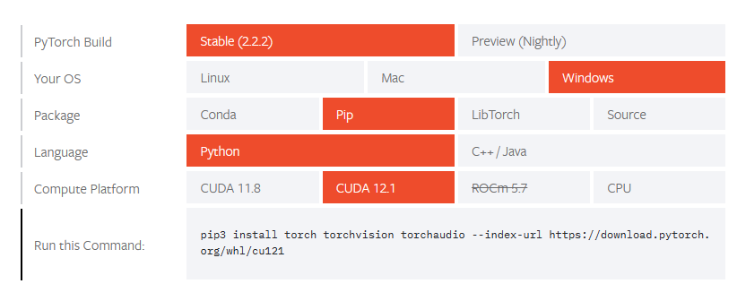

## CUDA环境安装

* 下载CUDA

电脑需配置NVIDIA显卡

[CUDA Toolkit 12.4 Update 1 Downloads](https://developer.nvidia.com/cuda-downloads?target_os=Windows&target_arch=x86_64&target_version=10&target_type=exe_local)

* 测试

```
Microsoft Windows [版本 10.0.19045.4170]
(c) Microsoft Corporation。保留所有权利。

C:\Users\JIA>nvidia-smi
Sat Apr  6 10:26:55 2024
+-----------------------------------------------------------------------------------------+
| NVIDIA-SMI 552.12                 Driver Version: 552.12         CUDA Version: 12.4     |
|-----------------------------------------+------------------------+----------------------+
| GPU  Name                     TCC/WDDM  | Bus-Id          Disp.A | Volatile Uncorr. ECC |
| Fan  Temp   Perf          Pwr:Usage/Cap |           Memory-Usage | GPU-Util  Compute M. |
|                                         |                        |               MIG M. |
|=========================================+========================+======================|
|   0  NVIDIA GeForce RTX 3070 Ti   WDDM  |   00000000:01:00.0  On |                  N/A |
|  0%   43C    P8             21W /  290W |    1121MiB /   8192MiB |      8%      Default |
|                                         |                        |                  N/A |
+-----------------------------------------+------------------------+----------------------+

+-----------------------------------------------------------------------------------------+
| Processes:                                                                              |
|  GPU   GI   CI        PID   Type   Process name                              GPU Memory |
|        ID   ID                                                               Usage      |
|=========================================================================================|

C:\Users\JIA>

```

## python环境安装

* miniconda

不要安装最新版本，安装历史版本python3.8版本

[https://docs.anaconda.com/free/miniconda/miniconda-other-installer-links/](https://docs.anaconda.com/free/miniconda/miniconda-other-installer-links/)

[历史版本](https://repo.anaconda.com/miniconda/)

```
Miniconda3-py38_23.10.0-1-Windows-x86_64.exe	71.6M	2023-11-16 13:51:53	126cda8fd680553cf13b79b0fc4f23f089f11ba03d3fc9c1927ae8af0c5bed3a
Miniconda3-py38_23.10.0-1-MacOSX-x86_64.sh	82.3M	2023-11-16 13:51:53	0e6921f44b4278aa178969f59da57ca4ced2a55ef7730c774296f1de1801c561
Miniconda3-py38_23.10.0-1-MacOSX-x86_64.pkg	81.9M	2023-11-16 13:51:53	d76c4f3347906d5d7027bb82d4bfd7e3996dbfdca87ea3f7493dc183cc6fa458
Miniconda3-py38_23.10.0-1-MacOSX-arm64.sh	80.1M	2023-11-16 13:51:53	c5ece9fce0a2f3c68600476e4256146f03511f82f76d05324eedbdc9eb06bed7
Miniconda3-py38_23.10.0-1-MacOSX-arm64.pkg	79.7M	2023-11-16 13:51:53	20d8610d667088fe0692de2341ce04159b327579a799bcbf9789d0f3824b3309
Miniconda3-py38_23.10.0-1-Linux-x86_64.sh	106.1M	2023-11-16 13:51:53	6842afb93a64fd4f04daa0f49f4618857d2327ead1366851eb0e49f1ae460f00
Miniconda3-py38_23.10.0-1-Linux-s390x.sh	101.9M	2023-11-16 13:51:53	095bfb828b3155e6a345b7e821010451dfd291e8373b618a3b72a050a1c7a909
Miniconda3-py38_23.10.0-1-Linux-ppc64le.sh	91.7M	2023-11-16 13:51:53	1d7ccb2fa31042116b38ec518a63428d9cf87adba8771ffa9f0e3241f6b5a72a
Miniconda3-py38_23.10.0-1-Linux-aarch64.sh	89.8M	2023-11-16 13:51:53	aee297bdefb15cfee9e2cb4c0881f811ce18c1a066ac75b811b21967ccd41acd
```

* 测试

运行 Anaconda Powershell Prompt (miniconda3)

```
(base) PS C:\Users\JIA> python --version
Python 3.8.18
```

## pytorch安装

[https://pytorch.org/get-started/locally/](https://pytorch.org/get-started/locally/)



